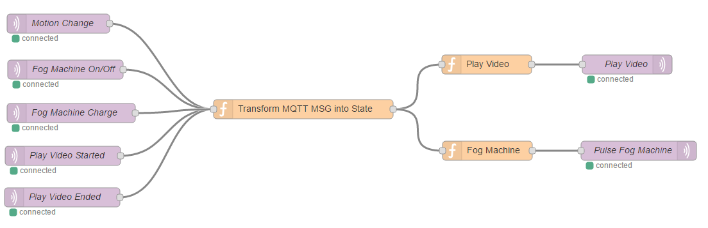
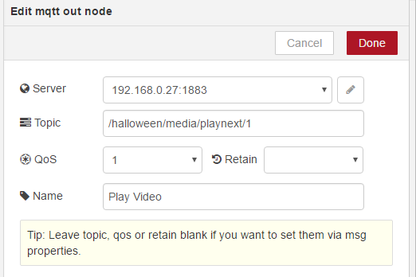

# Motion Play Video & Fogger
This scene controller is going to be used for my Halloween 2016 display.  I decided to purchase some fine video content that [AtmosFX](https://atmosfx.com/) produces.  I choose to use the [Witching Hour](https://atmosfx.com/collections/atmosfearfx/products/witching-hour) product as it is not too scary and looks fantastic.  I decided to implement this scene controller using [Node-Red](http://nodered.org/) on a Raspberry Pi.

## The Flow
The basic breakdown of this scene controller is to listen to the state changes of the motion sensor, fog machine and media player and transform these MQTT events into a state model.  As the state model changes it is reevaluated and a decision is made for the Media Player to play the next video or to turn on the fog machine. 



### Motion Change (MQTT Input)
This is an MQTT input node that is configured to listen for a motion sensor topic.


### Fog Machine On/Off (MQTT Input)
This is an MQTT input node that is configured to listen for when the Fog Machine is on or off.


### Fog Machine Charge (MQTT Input)
This is an MQTT input node that is configured to listen for when the Fog Machine is charging or not.


### Play Video Started (MQTT Input)
This is an MQTT input node that is configured to listen for when the Media Player begins to play a video.


### Play Video Ended (MQTT Input)
This is an MQTT input node that is configured to listen for when the Media Player video has ended.


### Transform MQTT MSG into State (Function)
This is a Function node that gets any of the MQTT messages as it's input and converts that to a state model object.

``` javascript
var motion1 = flow.get('motion1')||0;
var fog1 = flow.get('fog1')||0;
var charge1 = flow.get('charge1')||0;
var playvideo1 = flow.get('playvideo1')||0;

if (msg.topic=='/halloween/motion/value/1') {
    if (msg.payload == "1")
        motion1 = 1;
    else
        motion1 = 0;
    flow.set('motion1',motion1);
}
if (msg.topic=='/halloween/fog/on/1') {
    if (msg.payload == "1")
        fog1 = 1;
    else
        fog1 = 0;
    flow.set('fog1',fog1);
}
if (msg.topic=='/halloween/fog/charge/1') {
    if (msg.payload == "1")
        charge1 = 1;
    else
        charge1 = 0;
    flow.set('charge1',charge1);
}
if (msg.topic=='/halloween/media/playstarted/1') {
    playvideo1 = 1;
    flow.set('playvideo1',playvideo1);
}
if (msg.topic=='/halloween/media/playended/1') {
    playvideo1 = 0;
    flow.set('playvideo1',playvideo1);
}

msg.topic = '/halloween/state/';
msg.motion1 = motion1;
msg.fog1 = fog1;
msg.charge1 = charge1;
msg.playvideo1 = playvideo1;
return msg;
```

### Play Video (Function)
This is a Function node that interrogates the model and determines if the next video should be played.

``` javascript
if (msg.playvideo1!=1 && msg.motion1 == 1) {
    msg.topic = '/halloween/media/playnext/1';
    return msg;
}
return null;
```

### Play Video (MQTT Output)
This is an MQTT output node that sends a Play Next command to the media player.



### Fog Machine (Function)
This is a Function node that interrogates the model and determines if the Fog Machine should be turned on.

``` javascript
if (msg.fog1!=1 && msg.playvideo1==1  && msg.charge1==0) {
    msg.payload = '30';
    return msg;
}
return null;
```

### Pulse Fog Machine (MQTT Output)
This is an MQTT output node that sends a Pulse command to the fog machine.


